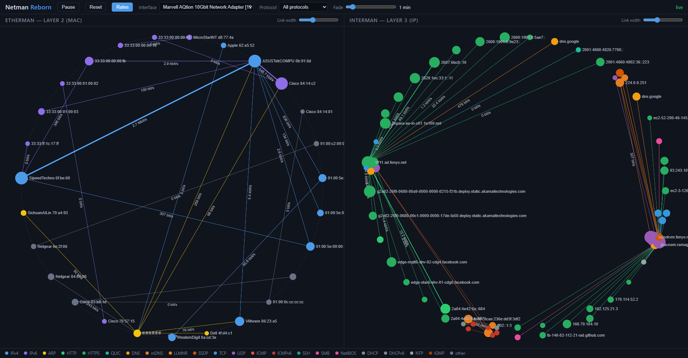

# Netman Reborn — Etherman + Interman

Recréation moderne de deux outils de la suite **Netman** (Curtin University,
1993) : **Etherman** (conversations couche 2, adresses MAC) et **Interman**
(conversations couche 3, IPv4 + IPv6), affichés **côte à côte** dans le
navigateur et alimentés par **une seule capture réseau**.

- Backend **Rust** : capture Npcap, agrégation, serveur HTTP/WebSocket (axum).
- Frontend **sigma.js v3** + graphology : Etherman dispose ses stations sur
  un cercle (réseau L2 plat) ; Interman dessine un cercle par réseau
  (classful IPv4, /64 IPv6), les réseaux répartis sur un anneau.
- Outil **strictement passif** : capture et affichage, aucune injection.

> **Pourquoi ce projet ?** J'ai utilisé les outils originaux de la suite
> Netman (Etherman, Interman…) sur station **Sun SPARC sous SunOS 4.1.3**,
> **au tout début des années 1990**, à
> **[Télécom Paris](https://www.telecom-paris.fr/)**, mon école d'ingénieur.
> Ce dépôt en est une recréation moderne, fidèle à leur esthétique et à leur
> esprit.



## Prérequis

- **Windows** (10/11). La capture est native Windows via **Npcap** — ne pas
  exécuter depuis WSL2 (son réseau virtualisé ne voit pas le trafic
  promiscuous de la carte physique).
- **[Npcap](https://npcap.com/#download)** installé (options par défaut).
  - Le mode « WinPcap API-compatible » n'est **pas** nécessaire : le binaire
    charge `wpcap.dll` depuis `C:\Windows\System32\Npcap` (delay-load +
    `SetDllDirectory`).
  - Si l'option « Restrict Npcap driver's access to Administrators only » a
    été cochée à l'installation de Npcap, lancez netman **en administrateur**.
    Avec les options par défaut, aucune élévation n'est nécessaire.
- Pour compiler : **Rust** (rustup, toolchain `stable-msvc`) + les Build Tools
  Visual Studio (C++) + un Windows SDK. Le SDK Npcap (link) est vendorisé dans
  `third_party/`, rien à configurer.

## Build

```powershell
cargo build --release
```

Le binaire est `target\release\netman.exe`. Il sert le dossier `static\`
(chemin réglable avec `--static-dir`), qui doit donc accompagner l'exécutable.

## Exécution

```powershell
# Sélection interactive de l'interface (liste numérotée) :
.\target\release\netman.exe

# Ou directement, par index ou sous-chaîne du nom de l'interface :
.\target\release\netman.exe --iface "Intel"
.\target\release\netman.exe --iface 12

# Rejouer un fichier .pcap (mode offline, sans carte réseau) :
.\target\release\netman.exe --pcap-file capture.pcap

# Options :
#   --port <n>        port HTTP/WebSocket (défaut 8080)
#   --fade <s>        délai initial de disparition des nœuds muets (défaut 60 s)
#   --static-dir <d>  dossier du frontend (défaut "static")
```

Puis ouvrez **http://localhost:8080**. `Ctrl-C` arrête proprement la capture
et le serveur.

> Pour voir plus que votre propre trafic + broadcast/multicast sur un réseau
> commuté, branchez la machine sur un port SPAN/miroir ou un TAP. C'est une
> question d'infrastructure : l'outil reste passif par conception.

## Interface

- **Etherman (gauche)** : un nœud par adresse MAC (étiqueté fabricant via la
  base OUI Wireshark embarquée), une arête par conversation L2. Les nœuds
  sont disposés **sur un grand cercle** — un réseau de niveau 2 est plat,
  toutes les stations partagent le même segment ; les conversations
  traversent le cercle, comme dans l'Etherman de 1993.
- **Interman (droite)** : un nœud par adresse IP (v4/v6, y compris réseaux
  distants), renommé automatiquement dès que le reverse-DNS (PTR) aboutit ;
  une arête par conversation L3. Les hôtes d'un même réseau **classful**
  (classe A → /8, classe B → /16, classe C → /24 ; multicast à part ;
  IPv6 regroupé par /64) forment **un cercle par réseau**, les réseaux se
  répartissant sur un anneau.
- **Mapping visuel** : taille de nœud ∝ log(octets cumulés) ; épaisseur
  d'arête ∝ log(**débit observé**, lissé sur ~3 s, décroissant quand le
  trafic cesse), avec un slider « Link width » par panneau pour amplifier ou
  réduire l'effet ; couleur = protocole dominant (légende en pied de page).
- **Contrôles** :
  - *Pause / Resume* — gèle les deux vues (la capture continue ; la reprise
    resynchronise sur l'état serveur) ;
  - *Reset* — efface l'historique des nœuds et liens côté serveur (comme si
    aucun paquet n'avait été reçu), en conservant les caches DNS ; un reset
    est aussi déclenché automatiquement au changement d'interface ;
  - *Rates* (actif par défaut) — affiche sur chaque lien le débit moyen
    bidirectionnel (unité adaptée : bit/s, kbit/s, Mbit/s, Gbit/s), calculé
    entre le premier et le dernier paquet observés depuis que le lien est
    affiché en continu (aucune mémoire après une disparition par fade) ;
  - *Protocol* — met en avant un protocole (les autres arêtes sont masquées,
    les nœuds estompés) ;
  - *Fade* — délai au bout duquel nœuds et arêtes silencieux disparaissent
    (5 s → 10 min, synchronisé entre tous les onglets ouverts).
- **Survol d'un nœud** : Etherman affiche la MAC complète et sa forme
  « Fabricant xx:yy:zz » ; Interman affiche l'IP et le nom résolu s'il est
  connu ; les deux ajoutent `out:` (débit sortant) et `in:` (débit entrant),
  calculés entre le premier et le dernier paquet observés depuis que l'hôte
  est affiché en continu.
- Molette = zoom, glisser = déplacement.

## Architecture (résumé)

```
thread OS pcap (bloquant, promiscuous, une seule capture)
  → parse etherparse → PacketMeta → channel (jamais bloquant côté capture)
  → agrégateur tokio : table L2 (MAC,MAC) + table L3 (IP,IP), tick 250 ms
  → deltas JSON atomiques (upsert/remove nœud/arête) → broadcast WebSocket
  → navigateur : 2 × (graphology + sigma.js + ForceAtlas2 worker)
```

Résolutions (OUI, PTR) : best-effort, asynchrones, avec cache — jamais sur le
chemin du paquet. Voir `RESEARCH.md` pour les versions figées et les choix
d'API, et `CLAUDE.md` pour les invariants du projet.

## Tests

```powershell
cargo test
```

Inclut le rejeu déterministe d'une fixture `.pcap`
(`tests/fixtures/sample.pcap`, vérifiée octet à octet contre son générateur).

## Mise à jour de la base OUI

```powershell
Invoke-WebRequest https://www.wireshark.org/download/automated/data/manuf `
  -OutFile src\resolve\data\manuf
cargo build --release
```
